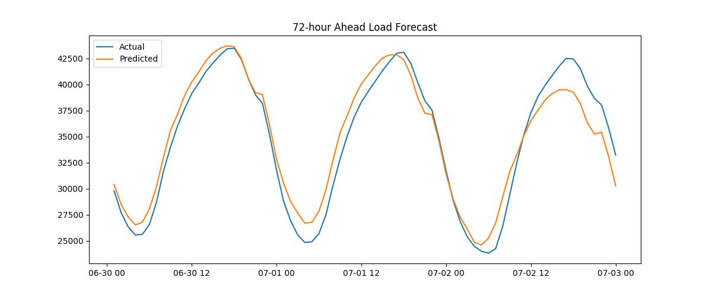

# 🚀 PJM Energy Load Forecasting — Residual Modeling with Classical & Neural Baselines

This project builds a **short-term energy load forecasting system** for PJM (the largest U.S. electricity market), using a combination of:

- **Naive baselines**
- **Classical statistical models (ETS, Fourier regression)**
- **Residual-based neural models (MLP-Res24)**
- **Rolling-window evaluation** to measure stability across time

The goal is to establish a **strong classical baseline suite** for benchmarking more advanced architectures (LSTM, TCN, NHITS, etc.) and to understand how different modeling choices behave on real-world, highly seasonal energy data.

---

## 🔍 Motivation

Short-term electricity load forecasting (1–72 hours ahead) is critical for:

- Grid reliability
- Operational planning
- Energy trading and pricing
- Economic dispatch
- Forecast-driven AI agents for utilities

PJM hourly load exhibits **dominant daily seasonality**, **weekly cycles**, and **weather-driven variability**. This makes PJM an excellent testbed for answering:

- How strong are simple baselines like **Naive-24**?
- How much extra signal exists in the **residuals** beyond seasonality?
- Can lightweight neural networks meaningfully improve over classical models?
- How do models behave across **different weeks** of the year?

This repository provides a clear foundation for answering these questions.

---

## 📦 Included Components

- **Data ingestion & cleaning** (raw PJM CSVs → cleaned hourly series)
- **Feature engineering**:
  - Calendar features (hour, dow, doy, holidays)
  - Fourier seasonal terms
  - Residual transformation (`res24 = load(t) − load(t−24)`)
- **Classical models**:
  - Naive-24 baseline
  - ETS (Exponential Smoothing)
  - Fourier regression (load-based and residual-based)
- **Neural model**:
  - MLP on residuals (MLP-Res24)
- **Rolling-window benchmarking**:
  - 20 runs across the year
  - 3-year training windows
  - Aggregated mean ± std metrics


---

## 🛠 Installation

Clone the repository:

```bash
git clone https://github.com/erfanili/energy-load-forecasting.git
cd energy-load-forecasting
```

Create a Python environment (recommended):
```bash
conda create -n energy python=3.10 -y
conda activate energy
```
Install dependencies:
```
pip install -r requirements.txt
```
---

## 📊 Rolling Evaluation Results (20 Runs)

| Model             | Mean MAE | Std MAE | Mean RMAE | Std RMAE |
|-------------------|----------|---------|-----------|----------|
| **MLP (Res24)**   | 1847.03  | 1039.71 | **0.05665** | 0.03105  |
| **Naive-24**      | 2018.10  | 798.58  | 0.06255   | 0.02353  |
| **ETS**           | 2834.56  | 884.45  | 0.08836   | 0.02620  |
| **Fourier (Load)**| 3566.19  | 1991.75 | 0.11119   | 0.05680  |


---

## 📈 Example Forecast — MLP-Res24 Model

The MLP-Res24 model learns short-term nonlinear structure in the **residuals**  
(`res24 = load(t) − load(t−24)`), then reconstructs the final load forecast.

Below is an example **72-hour forecast** using a 3-year training window:

### **Actual vs Predicted Load (MLP-Res24)**

<!-- Replace the file path with your actual plot -->


This plot demonstrates:

- The model tracks the **daily cycle** accurately  
- Captures **weekday/weekend effects**  
- Adapts to short-term ramps  
- Outperforms Naive-24 during high-volatility periods  

The full rolling evaluation shows MLP-Res24 achieves:

- **Mean RMAE:** 0.0566  
- **Std RMAE:** 0.0310  

making it the best-performing model among the classical baselines.


---
## ▶️ How to Run a Model

Each model in this repository has an executable pipeline script.  
You can run any model by specifying:

- the **region** (e.g., PJME)
- the **training period**
- the **testing period**
- optional model-specific parameters (e.g., window size for MLP)

Below are examples for each baseline.

### **Run the Naive-24 baseline**

```bash
python pipelines/naive24_pipeline.py \
    --region PJME \
    --train_period 2008-01-01:2011-09-01 \
    --test_period 2011-09-01:2011-09-04
```

### **Run the ETS model**

```bash
python pipelines/ets_pipeline.py \
    --region PJME \
    --train_period 2008-01-01:2011-09-01 \
    --test_period 2011-09-01:2011-09-04
```

### **Run the Fourier regression model**
```bash
python pipelines/fourier_pipeline.py \
    --region PJME \
    --train_period 2008-01-01:2011-09-01 \
    --test_period 2011-09-01:2011-09-04
```
### **Run the MLP-Res24 model**
```bash
python pipelines/mlp_res24_pipeline.py \
    --region PJME \
    --window 168 \
    --train_period 2008-01-01:2011-09-01 \
    --test_period 2011-09-01:2011-09-04
```

### **Run a Rolling 20-Run Evaluation (Benchmarking)**
```bash
python scripts/rolling_run.py \
    --region PJME \
    --model mlp_res24 \
    --window 168 \
    --train_years 3 \
    --runs 20
```

This performs:

- **3-year rolling training windows**
- **1–3 day test windows**
- **20 total runs** distributed across the year
- **Mean ± standard deviation** accuracy computation
- **Automatic saving** of results (JSON) and forecast plots (PNG/JPG)


## 📚 Data Sources
This project uses publicly available PJM hourly load.

## 👤 Author

**Erfan Esmaeili**  
Machine Learning Researcher — Energy, Finance, AI Systems  
GitHub: [erfanili](https://github.com/erfanili)  
Website: https://erfanili.github.io  
